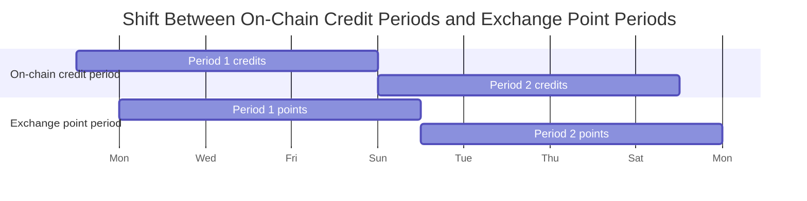

Credits determine your share of CreditTokens. CreditTokens are generated period by period, not as a single lump sum at the end of a series. This page explains how credits work, why periods exist, and how GCI lets the protocol track credits on-chain.

**Prerequisites:** [What is ArcX?](/learn/protocol-overview), [vToken](/learn/vtoken), [Series Lifecycle](/learn/series-lifecycle)

---

## Why Credits Exist

Without credits, CreditToken distribution would be trivially gameable. A naive design that distributes CreditTokens proportional to token balance right before a distribution lets anyone deposit one second before distribution and claim the same share as a day-one holder.

Credits prevent that by tracking not just what you hold, but how long you held it for.

---

## Series and Credit Periods

A **series** is a fixed-maturity market built on top of a vToken. Each series has a maturity date and its own ST and EPT tokens.

Each series is divided into equal-sized **credit periods**. These periods are chosen to match the reward cycle on the underlying exchange.

The main purpose of periods is to give credits different weights over time. Without periods, an early user and a late user with the same final balance could end up with the same reward exposure, even though the early user contributed for longer.

For protocols with active points programs, you can think of these credit periods as lining up with the exchange's point cycles. If an exchange calculates points weekly, ArcX can use one-week credit periods on-chain.

---

## Why Periods Are Shifted

There is one important nuance for exchanges with active points programs: on-chain periods may be shifted by a fixed amount relative to the exchange periods.

The reason is operational. Capital deposited on-chain is not instantly live on the exchange. It takes time for capital to move from the chain into the market maker's exchange positions.

For example, suppose:

- the deployment delay is **1 day**
- the exchange gives points from **Monday to Monday**

Then the capital that was actually active on the exchange for that Monday-to-Monday period was capital that had already arrived on-chain by the previous **Sunday**.

Capital that showed up on-chain after that Sunday was too late to be deployed before the exchange measured points for that week.

In cases like this, the period tracked on-chain is shifted relative to the period used off-chain by the exchange.

In this example, when an on-chain period ends, the corresponding period weight is reported one day later and CreditTokens are generated for that on-chain period.

---

## How Credits Are Calculated

Credits are a way to track what share of total CreditTokens you should receive at the end of every period.

From the protocol's perspective, the fair way to allocate credits is to measure:

$$
\text{capital} \times \text{time}
$$

We do not know the exact way each exchange calculates points internally. But for the protocol, capital multiplied by time is the cleanest approximation of fair participation.

---

## Calculating Credits

Your capital is not constant over time, because NAV grows as the underlying strategy earns yield.

So mathematically, capital multiplied by time becomes:

$$
\text{area under the capital-time curve}
$$

If your capital was constant, this would just be a rectangle. But because NAV grows, the curve slopes upward, so the area is a trapezoid.

That area is what credits are trying to track.

We cannot recompute area-under-the-curve for every user on-chain as time passes. So instead, the protocol tracks a global accumulator called **GCI**.

---

## What GCI Is

**GCI** stands for **Global Credit Index**.

GCI is the amount of credits earned **per EPT share** over time. The point of tracking GCI is that the protocol does not need to store a full capital-time history for every user.

Instead, when a user's balance changes, credits can be computed from:

$$
\text{balance} \times (\text{new GCI} - \text{previous GCI})
$$

This is the key simplification:

- GCI tracks credits earned per share globally
- each user only needs their balance and the last GCI checkpoint relevant to them

For credit purposes:

- `1 vToken` earns credits at the same rate as `1 EPT`
- both contribute equally to period credit accumulation

---

## How GCI Is Calculated

For any time interval:

$$
\text{GCI increment} = \frac{\text{NAV}_{start} + \text{NAV}_{end}}{2} \times \text{days}
$$

This is the average NAV over the interval multiplied by the duration.

Equivalently:

$$
\text{GCI increment} = r_1 \times \Delta t + \frac{1}{2} \times \Delta t \times (r_2 - r_1)
$$

where:

- $r_1$ = NAV at the start of the interval
- $r_2$ = NAV at the end of the interval
- $\Delta t$ = time elapsed in days

Geometrically, this is the area of a trapezoid under the capital-time curve.

---

## How User Credits Are Calculated

Your credits over any interval are:

$$
\text{your credits} = \text{your balance} \times \text{GCI increment}
$$

More generally, whenever your balance changes, the protocol can settle the credits earned since your last checkpoint by multiplying your balance by the change in GCI over that interval.

That is why GCI is useful: it turns a continuous capital-times-time problem into a simple checkpointing problem.

---

## Fresh Credits on Transfer

When tokens change hands, the new holder starts fresh from that moment.

- **Orderbook purchase:** you buy EPT and start with zero prior credits
- **Minting:** you deposit USDC and receive freshly minted vTokens that start from zero prior credits
- **No credit inheritance:** the buyer does not receive the seller's previously accumulated credits

Credits are non-transferable. Only future holding time counts for the new owner.

---

## Period-by-Period CreditToken Distribution

CreditTokens are generated period by period:

$$
\text{yourCreditTokens} = \sum_{p=1}^{P} \frac{\text{yourCredits}_p}{\text{totalCredits}_p} \times \text{periodWeight}_p
$$

where:

- $P$ = number of credit periods
- $\text{yourCredits}_p$ = your credits during period $p$
- $\text{totalCredits}_p$ = all credits during period $p$
- $\text{periodWeight}_p$ = the oracle-submitted weight for that period

This is why early participation matters. If earlier periods carry higher weights, early holders get that upside. Later entrants do not dilute those earlier periods.

For protocols with points programs, you can think of period weights as proportional or equal to the points received for the corresponding period. If one week generates more points than another, that week can receive a higher CreditToken weight.

---

## Worked Example

The objective of this example is to show that an early holder can keep a large advantage even when a later user brings in enough capital to match the same total capital x time.

**Setup:** 10-week series.
- Alice holds 100 vTokens from week 1
- Bob buys 250 EPT at week 7
- Weeks 1-6 have a period weight of 800 per week
- Weeks 7-10 have a period weight of 200 per week

Bob brings in more capital later so that his capital x time is the same as Alice's:

- Alice: 100 x 10 weeks = 1,000 token-weeks
- Bob: 250 x 4 weeks = 1,000 token-weeks

**Weekly distribution:**

| Week | Alice total credits | Bob total credits | Alice's share of CreditTokens |
|------|---------------------|-------------------|-------------------------|
| 1-6  | 100 x 6 = 600 | 0 x 6 = 0 | 600 / (600 + 0) = 100% |
| 7-10 | 100 x 4 = 400 | 250 x 4 = 1,000 | 400 / (400 + 1,000) = 28.6% |

**CreditTokens:**

| Holder | Weeks 1-6 | Weeks 7-10 | Total | Share |
|--------|-----------|------------|-------|-------|
| Alice  | 4,800 (800 x 6 weeks at 100%) | 228.6 (200 x 4 weeks x 28.6%) | **5,028.6** | **86.2%** |
| Bob    | 0 | 571.4 (200 x 4 weeks x 71.4%) | **571.4** | **13.8%** |

Even though Bob contributes the same total capital x time as Alice, Alice gets far more CreditTokens because the earlier weeks were richer and those periods are locked in to the early holder.

<Info>
These examples use simplified credit amounts for clarity. In production, credit amounts vary with NAV growth, and GCI accounts for that automatically.
</Info>
