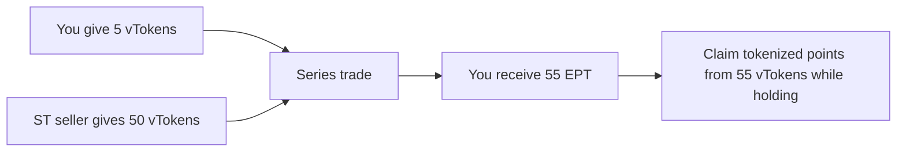

Each **vToken** can be part of a [series](/learn/series-lifecycle). A **series** is a fixed period of time with a maturity date where two vToken holders can exchange points for money.

**EPT** is the component you hold when you want to buy points upfront and get leveraged points exposure until maturity.

## What Is EPT

Every **vToken** in a series splits into:

$$1 \text{ vToken} = 1 \text{ ST} + 1 \text{ EPT}$$

One side wants fixed yield and sells points. The other side pays upfront for those points and holds the **points side** through **EPT**.

EPT is your claim on exchange points earned by the vault's strategy during a series. While you hold EPT, you accrue credits. Your credit share determines how many PointsTokens you can claim.

EPT trades on the **EPT/vToken** orderbook. You buy EPT for a small upfront price because you are only buying the points side, not the principal + yield side.

See [Orderbook Guide](/learn/orderbook-guide) for how to reason about APR and place EPT orders in the app.

---

## Credits

EPT accrues **credits** while you hold it — the longer you hold and the more you hold, the bigger your share of points. Credits are tracked automatically on-chain. No oracle.

**Fresh start.** When you buy EPT, your credit counter starts from zero. The seller keeps their accumulated credits. No credit inheritance.

**Hold earlier, earn more. Weekly point distributions are locked in, so later buyers do not share in earlier weeks.**

See [Credit Mathematics](/deep-dives/credit-mathematics) for the GCI formula and worked examples.

---

## Buy the Points Side

ST buyers are selling points for fixed yield. That leaves EPT available at a low upfront price because it only represents the points side.

**Example.** EPT trades at \$0.02. That means for the cost of 1 vToken, you can buy **50 EPT**.

- Price per EPT: \$0.02
- EPT bought with 1 vToken: 1 / 0.02 = **50 EPT**
- **Points exposure scales with how many EPT you can hold for the same upfront cost**

The cheaper EPT is, the more points exposure you can buy for the same amount of capital.

### EPT Price Falls Over the Series

As the series progresses, fewer credits remain to be earned. An EPT bought at week 1 accrues credits for many more weeks than one bought at week 6. The market prices this in: EPT gets cheaper over time.

Same price at different times means different APR.

---

## Fees

We charge a fee on points received by EPT holders for the leverage ArcX provides. You can find the exact fee details on the series page in the UI.

---

## Claiming PointsTokens

While you hold EPT, points are distributed based on your credit share. As those points are distributed, you can claim them as [PointsTokens](/learn/points-token).

Your allocation is based on your credit share. Claim PointsTokens from the UI when they become available.

Each series produces a separate EPT. Credits do not carry over between series.
