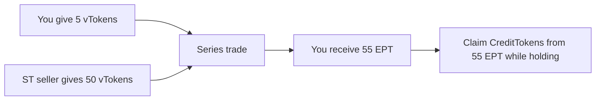

Each **vToken** can be part of a [series](/learn/series-lifecycle). A **series** is a fixed period of time with a maturity date where users can separate the principal + yield side from the rewards side.

**EPT** is the component you hold when you want rewards-side exposure until maturity.

## What Is EPT

Every **vToken** in a series splits into:

$$1 \text{ vToken} = 1 \text{ ST} + 1 \text{ EPT}$$

One side wants principal + yield exposure and gives up the rewards side. The other side pays upfront and holds the **rewards side** through **EPT**.

EPT accrues credits while you hold it. Your credit share determines how many CreditTokens you can claim for each period.

EPT trades on the **EPT/vToken** orderbook. You buy EPT for a small upfront price because you are only buying the rewards side, not the principal + yield side.

See [Orderbook Guide](/learn/orderbook-guide) for how to reason about APR and place EPT orders in the app.

---

## Credits

EPT accrues **credits** while you hold it — the longer you hold and the more you hold, the bigger your share of CreditTokens. Credits are tracked automatically on-chain.

**Fresh start.** When you buy EPT, your credit counter starts from zero. The seller keeps their accumulated credits. No credit inheritance.

**Hold earlier, earn more.** Earlier credit periods are locked in, so later buyers do not dilute earlier holders.

See [Credit Mathematics](/deep-dives/credit-mathematics) for the GCI formula and worked examples.

---

## Buy the Rewards Side

ST buyers give up the rewards side for principal + yield exposure. That leaves EPT available at a low upfront price because it only represents the rewards side.

**Example.** EPT trades at \$0.02. That means for the cost of 1 vToken, you can buy **50 EPT**.

- Price per EPT: \$0.02
- EPT bought with 1 vToken: 1 / 0.02 = **50 EPT**
- **Rewards-side exposure scales with how many EPT you can hold for the same upfront cost**

The cheaper EPT is, the more rewards-side exposure you can buy for the same amount of capital.

### EPT Price Falls Over the Series

As the series progresses, fewer credits remain to be earned. An EPT bought at week 1 accrues credits for many more weeks than one bought at week 6. The market prices this in: EPT gets cheaper over time.

Same price at different times means different APR.

---

## Fees

We charge a fee on CreditTokens received by EPT holders for the rewards-side exposure ArcX provides. You can find the exact fee details on the series page in the UI.

---

## Claiming CreditTokens

While you hold EPT, credits accrue based on your balance and holding time. CreditTokens become claimable based on your credit share and the period weights submitted through the oracle.

Claim CreditTokens from the UI when they become available. Market makers can share rewards received from the underlying protocol with CreditToken holders.

Each series produces a separate EPT. Credits do not carry over between series.
