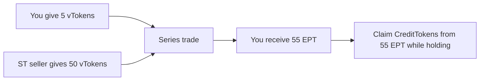

Each **vToken** can be part of a [series](/learn/series-lifecycle). A series lets users separate the underlying-token side, including any yield, from the points side until a fixed maturity.

**EPT** is the component you hold when you want points exposure until maturity.

## What Is EPT

Every **vToken** in a series splits into:

$$1 \text{ vToken} = 1 \text{ ST} + 1 \text{ EPT}$$

One side wants the underlying-token side and gives up the points side. The other side pays upfront and holds the **points side** through **EPT**.

EPT accrues credits while you hold it. Your credit share determines how many CreditTokens you can claim for each period.

EPT trades on the **EPT/vToken** orderbook. You buy EPT for a small upfront price because you are only buying the points side, not the underlying token or any yield it carries.

See [Orderbook Guide](/learn/orderbook-guide) for how to reason about APR and place EPT orders in the app.

---

## Credits

EPT accrues **credits** while you hold it — the longer you hold and the more you hold, the bigger your share of CreditTokens. Credits are tracked automatically on-chain.

**Fresh start.** When you buy EPT, your credit counter starts from zero. The seller keeps their accumulated credits. No credit inheritance.

**Hold earlier, earn more.** Earlier credit periods are locked in, so later buyers do not dilute earlier holders.

See [Credit Mathematics](/deep-dives/credit-mathematics) for the GCI formula and worked examples.

---

## Buy the Points Side

ST buyers give up the points side for the underlying-token side. That leaves EPT available at a low upfront price because it only represents the points side.

**Example.** EPT trades at 0.02 vToken. That means for the cost of 1 vToken, you can buy **50 EPT**.

- Price per EPT: 0.02 vToken
- EPT bought with 1 vToken: 1 / 0.02 = **50 EPT**
- **Points exposure scales with how many EPT you can hold for the same upfront cost**

The cheaper EPT is, the more points exposure you can buy for the same amount of capital.

### EPT Price Falls Over the Series

As the series progresses, fewer credits remain to be earned. An EPT bought at week 1 accrues credits for many more weeks than one bought at week 6. The market prices this in: EPT gets cheaper over time.

Same price at different times means different APR.

---

## Fees

We charge a fee on CreditTokens received by EPT holders for the points exposure ArcX provides. You can find the exact fee details on the series page in the UI.

---

## Claiming CreditTokens

While you hold EPT, credits accrue based on your balance and holding time. After the market operator submits a point weight on-chain, the contracts automatically issue CreditTokens according to your share of the period's credits.

Claim CreditTokens from the UI when they become available. Depending on the vault's reward arrangement, rewards received from the underlying protocol can be distributed to CreditToken holders through the configured claim logic.

Each series produces a separate EPT. Credits do not carry over between series.

<Info>
[CreditTokens can be traded](/learn/credit-token-trading) after they are generated.
</Info>
