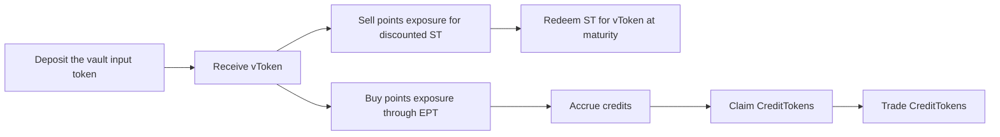

ArcX is a vault decomposition and trading protocol. It works with vaults connected to yield protocols, points programs, trading strategies, and other on-chain or off-chain sources of value.

## The Problem

A vault position can combine several kinds of exposure:

- the price of the underlying token in the vault
- any yield earned by that token or the underlying protocol
- points

These exposures have different risk and return profiles, but they are usually bundled into one position. A user who wants the underlying side must also hold the points side, and a user who wants the points side must fund the whole position.

## The ArcX Model

Each ArcX vault accepts a supported input token and issues a **vToken** representing the vault position. A vault may generate yield, points, or both through its underlying protocol. A vToken can be split into an ST and an EPT for a fixed duration, called a **series**:

- **ST (Strategy Token)** carries the underlying side, including any yield in the position, without the points exposure.
- **EPT (Expected Points Token)** carries the points side and accrues credits.
- **CreditToken** is generated from those credits and is used for reward distribution.

After the market operator submits point weights on-chain, the contracts automatically issue **CreditTokens** according to the credit shares accrued through the points side. CreditTokens are transferable and can also be traded independently.

For a vault without underlying APY, ST is simply the underlying-token side and NAV remains constant. When vToken earns yield, that value is reflected either in its NAV or in the price of the input token itself. ST retains exposure to that value because it redeems for vToken; EPT does not.

## Who is ArcX For?

<CardGroup cols={2}>
  <Card title="Points Buyer" icon="chart-line">
    Buy EPT for concentrated points exposure without also paying for the underlying side or its yield. Credits accrued by EPT determine CreditToken issuance.
  </Card>
  <Card title="Yield Seeker" icon="vault">
    EPT buyers pay for the points side of a vToken, leaving ST available below 1 vToken. Buy discounted ST to keep the underlying and any yield without the points exposure.
  </Card>
</CardGroup>

CreditToken markets add a second way to buy or sell that tokenised points exposure after credits have generated the token.

---

## The Tokens

<CardGroup cols={2}>
  <Card title="vToken" icon="circle-dollar-to-slot" href="/learn/vtoken">
    The base vault share used to enter a series, settle ST/EPT trades, and withdraw.
  </Card>
  <Card title="Strategy Token (ST)" icon="vault" href="/learn/strategy-token">
    The underlying-token side, including any yield but without points exposure. It redeems for vToken at maturity.
  </Card>
  <Card title="Expected Points Token (EPT)" icon="star" href="/learn/expected-points-token">
    The points side. It accrues credits that determine CreditToken issuance.
  </Card>
  <Card title="CreditToken" icon="coins" href="/learn/credit-token">
    A vault-specific token generated from credits and used for reward distribution.
  </Card>
</CardGroup>

---

## How It Works

<Steps>
  <Step title="Deposit">
    Choose a vault and deposit its supported input token. You receive **vToken** shares at the vault's current NAV.
  </Step>
  <Step title="Choose the side you want">
    Move from vToken into discounted **ST** to give up future points while retaining the underlying side, or buy **EPT** for concentrated points exposure.
  </Step>
  <Step title="Redeem and claim">
    ST redeems for vToken at maturity. EPT stops accruing credits for that series, and eligible vToken and EPT holders can claim CreditTokens as credit periods are finalized.
  </Step>
</Steps>

### NAV, Yield, and Credits

**NAV** is the value of one vToken's vault position, expressed in the vault's accounting unit.

- If the vault has no underlying APY, NAV remains constant.
- Yield earned by vToken is reflected either in its NAV or in the price of the input token itself.
- Points are not included in NAV. ArcX accounts for that side through credits and CreditTokens.

Credits track participation over time. Both vToken and EPT can accrue credits, and point weights determine how each period contributes to automatic CreditToken issuance.

See [Credit Mathematics](/deep-dives/credit-mathematics) for the NAV-based GCI model.

---

## Trade Future Points or CreditTokens

ArcX has two separate markets:

- **ST/EPT markets trade future points exposure.** A series lets users bid today for points the vault has not received yet. EPT buyers acquire that future points exposure, while ST buyers sell it in exchange for a discount. These markets are quoted in APR because the exposure accrues only until the series matures.
- **CreditToken markets trade issued CreditTokens.** After the market operator submits point weights on-chain, the contracts automatically issue CreditTokens from the finalised credit shares. These markets use a direct quote-token-per-CreditToken price rather than APR.

[CreditToken trading](/learn/credit-token-trading) transfers an existing token. Trading does not change the on-chain point weights or create new CreditTokens.

---

## Fees

Fees are market-specific and shown in the app. Depending on the vault or market, they can include:

- a vToken performance fee on yield or CreditTokens distributed through vToken
- an EPT fee on CreditTokens received through points exposure
- maker or taker fees on CreditToken trades

Always review the displayed fee settings and expected received amount before confirming.

---

## Series

A **series** is a fixed-maturity market built on one vToken. Every series has its own ST, EPT, and maturity date.

Until maturity, ST and EPT let users trade the underlying side and points side independently. At maturity, ST redeems for vToken, EPT stops accruing new credits for that series, and the base vToken continues to operate according to its vault rules.

See [Series Lifecycle](/learn/series-lifecycle) for details.

---

## Vault-Specific Terms

The common ArcX flow is the same across vaults, but the underlying protocol, input token, yield behavior, points program, withdrawal timing, operators or counterparties, supported networks, and risks can differ.

Review the vault page, market terms, [Trust Model & Security](/learn/trust-model-and-security), and [Risk Disclosure](/legal/risk-disclosure) before participating.
