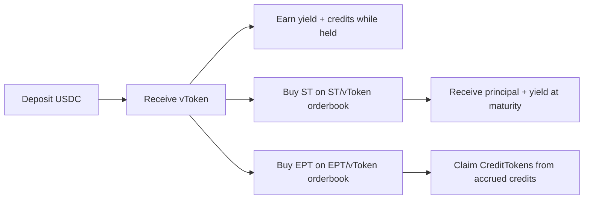

## The Problem

Getting rewards on perp DEXes is capital inefficient. You deposit capital, lock it in a strategy, earn yield, and wait to see how any reward program develops. You cannot separate yield from rewards, and you cannot choose the exact exposure you want.

## The Solution

We wrap perp DEX strategies into a **vToken** — a vault share that earns yield and accrues credits for supported reward programs. Hold vToken for the combined exposure, or use your vTokens to buy **ST** (principal + yield) or **EPT** (rewards side) on the orderbook.

Reward buyers buy EPT for rewards-side exposure. Yield seekers buy ST at a discount for principal + yield exposure. Each user chooses the side they want, at a price set by the market.

---

## Who is ArcX For?

<CardGroup cols={3}>
  <Card title="Reward Buyer" icon="chart-line">
    Deposit \$100 for vTokens. Buy EPT on the orderbook. At \$0.02 per EPT, you end up holding **5,000 EPT** for concentrated rewards-side exposure.
  </Card>
  <Card title="Yield Seeker" icon="vault">
    EPT buyers pay for the rewards side of a vToken, leaving ST available below NAV. You pick it up at a discount and keep the principal + yield side.
  </Card>
  <Card title="Just Hold vToken" icon="wallet">
    Earn yield and accrue credits for supported reward programs in one token. The simplest way to use ArcX.
  </Card>
</CardGroup>

**Exit:** Sell your ST or EPT on the orderbook to receive vTokens. Withdraw vTokens for USDC.

---

## The Tokens

<CardGroup cols={2}>
  <Card title="vToken" icon="circle-dollar-to-slot" href="/learn/vtoken">
    The base. Vault share that earns yield + credits.
  </Card>
  <Card title="Strategy Token (ST)" icon="vault" href="/learn/strategy-token">
    Principal + yield side. Redeems back into vToken at maturity.
  </Card>
  <Card title="Expected Points Token (EPT)" icon="star" href="/learn/expected-points-token">
    Rewards-side token. Accrues credits and can be used to claim CreditTokens.
  </Card>
  <Card title="CreditToken" icon="coins" href="/learn/credit-token">
    Token generated from credits and used for reward distribution.
  </Card>
</CardGroup>

---

## How It Works

<Steps>
  <Step title="Deposit USDC">
    Deposit USDC into a vault. You receive **vToken** shares at the current NAV. Your vToken earns yield and accrues credits for supported reward programs.
  </Step>
  <Step title="Trade (for power users)">
    Use your vTokens to buy **EPT** (rewards-side exposure) or **ST** (principal + yield exposure) on the orderbook.

    This is for users who want to separate the rewards side from the principal + yield side.
  </Step>
  <Step title="Redeem">
    **vToken:** Hold for combined yield and credit exposure. You can withdraw for USDC and claim CreditTokens when they become available.

    **ST:** Redeems back into vToken at maturity.

    **EPT:** Can be used to claim CreditTokens based on accrued credits.
  </Step>
</Steps>

### Where Do Yield and Rewards Come From?

When users deposit into a vault, that capital is packaged into **vToken** and lent out to professional market makers. Those market makers run strategies on perp DEXes and return value to the vault through either a fixed rate or a performance-fee split. That return flows back into the vault, and the **NAV** of the vToken tracks it over time.

At the same time, those market maker strategies can participate in reward programs on the underlying venues. ArcX tracks user credits on-chain. Those credits generate CreditTokens, and market makers can share rewards received from the underlying protocol with CreditToken holders.

Yield and credits are handled differently:

- **Yield** is reflected in vToken NAV. Your balance multiplied by NAV determines what your yield position is worth.
- **Credits** are based on holding time, not just balance. Both vToken and EPT track user holding time through credits. Those credits generate CreditTokens according to the credit period weights.

See [Credit Mathematics →](/deep-dives/credit-mathematics) for the details of how credits accrue and how CreditTokens are split across users. See [Risk Disclosure →](/legal/risk-disclosure) for reward-program and distribution risks.

---

## Fees

We charge two types of fees:

- **vToken performance fee** — a cut of the yield and CreditTokens distributed through the vToken.
- **EPT leverage fee** — a fee on CreditTokens received by EPT holders, charged for the rewards-side exposure ArcX provides.

Exact fees can vary by market. You can always see the current fee settings on the app.

---

## Series

**vToken** behaves like a vault share. You can deposit and withdraw as long as you account for withdrawal delays and any lockup windows shown on the market page.

**ST** and **EPT** are created as part of fixed-maturity series.

Each vToken can have multiple series over time. Every series has its own maturity date and its own **ST** and **EPT** tokens.

Until maturity, ST and EPT let users isolate principal + yield exposure or rewards-side exposure for that series. At maturity, ST redeems back into vToken, while EPT stops earning new exposure for that series and can be used to claim CreditTokens.

See [Series Lifecycle](/learn/series-lifecycle) for details.

---

## Vaults at Launch

Each vault pairs a professional market maker with one or more perp DEXes. The market maker borrows vault capital, runs their own trading strategies, and returns value to the vault through either a fixed rate or a performance-fee split. ArcX does not dictate or operate the trading — each market maker runs their own book.

Each vault has its own vToken. ST and EPT derived from each vault are specific to that vault and series.
