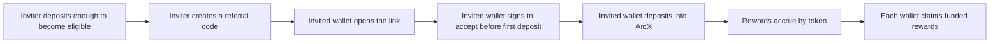

ArcX referrals reward both sides of a valid invite.

The current referral program is designed around **10% rewards**: the inviter earns referral rewards from eligible activity by the invited wallet, and the invited wallet can receive its own referral rebate on that activity. Rewards are tracked by token and claimed from the **Referrals** page.

<Info>
  Referral economics, eligibility requirements, and supported markets can change over time. The app always shows the current claimable rewards and referral eligibility for your connected wallet.
</Info>

---

## How It Works



<Steps>
  <Step title="Create a code">
    Connect your wallet on the Referrals page. If your wallet meets the minimum deposit requirement, create a 5-character alphanumeric referral code.
  </Step>
  <Step title="Share your link">
    Share the referral link with friends. The link sends them to the ArcX join flow for your code.
  </Step>
  <Step title="Your friend accepts">
    The invited wallet must explicitly accept the referral before its first ArcX vault deposit. Accepting requires a wallet signature so another user cannot assign a referral on their behalf.
  </Step>
  <Step title="Rewards accrue">
    Once the invited wallet deposits into eligible ArcX vaults, referral rewards can accrue from yield and CreditToken reward streams.
  </Step>
  <Step title="Claim">
    Funded rewards appear in the Reward Claim table. Claims are submitted per reward token.
  </Step>
</Steps>

---

## Creating a Referral Code

To create a referral code:

1. Open the **Referrals** page.
2. Connect the wallet you want to use as the inviter.
3. Deposit at least the minimum required amount into ArcX vaults. The standard program threshold is currently **50 USDC**, and the app displays the current requirement for your wallet.
4. Create a 5-character alphanumeric code.

Each wallet can have one referral code. Once created, your code is shown on the Referrals page together with your share link.

### Code Format

Referral codes are:

- exactly 5 characters
- letters and numbers only
- normalized to uppercase
- unique across ArcX

Example:

```text
ARCX1
```

---

## Accepting a Referral

An invited wallet can accept a referral in two ways:

- open an ArcX referral link, or
- enter a referral code on the Referrals page.

Acceptance has three important rules:

- The wallet must accept **before its first ArcX vault deposit**.
- A wallet can have only one inviter.
- Self-referrals are not allowed.

When you accept a referral, ArcX asks for a short wallet signature. This signature proves the connected wallet is intentionally accepting the referral. It is not a token approval and does not transfer funds.

<Warning>
  If you already deposited into an ArcX vault, you can no longer accept a new referral for that wallet.
</Warning>

---

## Rewards

Referral rewards are tracked in kind.

That means yield rewards and CreditToken rewards are shown separately because they are different assets:

| Reward type | How it appears | Why it is separate |
| --- | --- | --- |
| Yield rewards | USDC or the vault's underlying payout token | Yield is fungible across the same payout token |
| CreditToken rewards | The CreditToken for the relevant vault | Each vault can have its own CreditToken and reward source |

The Summary of Invitations card shows:

- **Referral Rewards** - total earned rewards shown in a compact format
- **Available to Claim** - funded rewards available right now
- **Referred Friends** - wallets that accepted your referral
- **Friends Who Deposited** - referred wallets that made an ArcX vault deposit

---

## Reward Claim

The **Reward Claim** table shows token-level claim rows.

Each row includes:

| Column | Meaning |
| --- | --- |
| Reward | The token you can claim |
| Source | The vault or reward stream that generated the row |
| Earned | Total rewards accrued for that token |
| Available | Funded rewards available to claim now |
| Status | Whether the token is ready, waiting for funding, processing, or already claimed |
| Action | Claim button for that reward token |

Common statuses:

| Status | Meaning |
| --- | --- |
| Ready | The payout wallet has enough funds and the reward can be claimed |
| Awaiting funding | Rewards accrued, but the payout wallet needs to be funded before claiming |
| Processing | A claim transaction has been submitted and is waiting for confirmation |
| Claimed | The available amount for that token has already been paid |

<Info>
  Earned rewards and available rewards can differ. Earned is the accounting total. Available is the portion that is funded and claimable from the payout wallet right now.
</Info>

---

## Reward History

The **Reward History** table is friend-first.

The collapsed row keeps the page scannable:

| Friend | Joined | Yield | Points |
| --- | --- | --- | --- |
| `0x12...ab9` | Mar 03, 2026 | `12.40 USDC` | CreditToken sources |

Expand a friend to see the vault-level detail:

| Vault | Yield | CreditToken |
| --- | --- | --- |
| Example Vault | `8.10 USDC` | `1,240 cEXAMPLE` |

This matters because one referred wallet can deposit into multiple ArcX vaults, and each vault can produce a different CreditToken.

---

## Rules and Abuse Prevention

ArcX referral accounting is built around explicit wallet intent and first-deposit eligibility.

- A referral must be accepted before the invited wallet's first ArcX vault deposit.
- A wallet can have only one inviter.
- A wallet can create only one referral code.
- The inviter must meet the minimum deposit requirement before their code can be used.
- Self-referrals are not eligible.
- Rewards are based on eligible ArcX vault activity.
- Referral statistics and rewards can update with a delay while indexing and reward jobs process on-chain activity.
- ArcX may adjust referral rates, eligibility, supported markets, or program rules.

---

## Related Reading

<CardGroup cols={2}>
  <Card title="User Guide" icon="compass" href="/learn/user-guide">
    Deposit, trade, claim, and withdraw through the ArcX app.
  </Card>
  <Card title="CreditToken" icon="coins" href="/learn/credit-token">
    Learn how credits become CreditTokens across vaults and periods.
  </Card>
</CardGroup>
