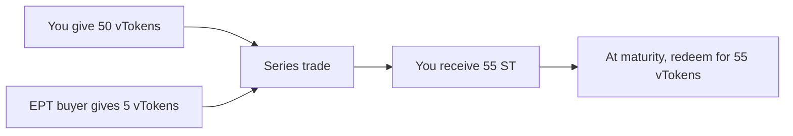

Each **vToken** can be part of a [series](/learn/series-lifecycle). A series lets users separate the underlying-token side, including any yield, from the points side until a fixed maturity.

**ST** is the underlying side of a series, including any yield but without the points exposure. It is the component you hold when you sell future points exposure for an upfront discount.

## What Is ST

Every **vToken** in a series splits into:

$$1 \text{ vToken} = 1 \text{ ST} + 1 \text{ EPT}$$

One side wants points exposure and pays upfront for EPT. The other side gives up that points exposure and holds the **underlying-token side** through **ST**.

ST carries the underlying side of the split **without the points exposure**. It retains exposure to any yield earned by vToken because it redeems for vToken at maturity. Depending on the vault design, that yield is reflected either in vToken NAV or in the price of the input token itself. For a vault without underlying APY, NAV remains constant and ST is simply the underlying-token side.

At maturity, ST redeems **1:1 for vToken**.

ST trades on the **ST/vToken** orderbook. You buy ST at a discount below 1 vToken. The discount exists because EPT buyers are paying for the points side of the vToken: the more they pay for EPT, the cheaper ST gets.

See [Orderbook Guide](/learn/orderbook-guide) for how to reason about APR and place ST orders in the app.

---

## Buy the Discount

EPT buyers pay for the points side of the vToken, leaving ST available below **1 vToken**. That discount is separate from any yield already carried by the vault position.

**Example.** ST trades at 0.98 vToken. A yield-bearing vault has 12% net APR. Over a 60-day series:

- ST discount: 0.02 vToken
- underlying vault return over 60 days: approximately 2%
- the holder receives the underlying vault return plus the effect of buying ST below its 1 vToken redemption value

For a zero-yield vault, only the ST discount contributes to this return. The exact annualized figures shown in the app depend on time to maturity and the order price.

---

## Redemption

At maturity, **1 ST = 1 vToken**.

Your ST redeems back into vToken.

Your ST is burned. No fee on redemption.

---

## Selling Before Maturity

Sell ST on the orderbook at any time before maturity. You receive vTokens. This is a market sale, not redemption — you get whatever price the market offers.

As the series approaches maturity, ST price tends to converge toward **1 vToken**.

---

## What Drives ST Price

| Factor | Effect |
|---|---|
| EPT demand | More EPT buying means more capital paying for the points side, widening the ST discount |
| Yield seeker demand | Absorbs ST supply, narrowing the discount |
| Time to maturity | Price tends to converge toward 1 vToken as the series ends |
| Vault NAV and yield | Determine the value carried by the vToken that ST redeems into, but do not by themselves set the ST/vToken discount |

The ST discount reflects the market price of the points side. When points demand is high, EPT buyers pay more, widening the ST discount. Yield seekers buy ST at that discount and earn a higher effective return.
