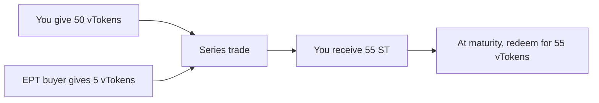

Each **vToken** can be part of a [series](/learn/series-lifecycle). A **series** is a fixed period of time with a maturity date where users can separate the principal + yield side from the rewards side.

**ST** is the component you hold when you want principal + yield exposure and are willing to give up the rewards side until maturity.

## What Is ST

Every **vToken** in a series splits into:

$$1 \text{ vToken} = 1 \text{ ST} + 1 \text{ EPT}$$

One side wants rewards-side exposure and pays upfront for EPT. The other side gives up that rewards side and holds the **principal + yield** side through **ST**.

ST represents your claim on the vault's principal + yield side. The vault returns value through either a fixed rate or a performance-fee split, and that value flows into NAV over time. At maturity, ST redeems back into vToken.

ST trades on the **ST/vToken** orderbook. You buy ST at a discount, so the price of ST is below 1 vToken. In dollar terms, that means ST trades below NAV. The discount exists because EPT buyers are paying for the rewards side of the vToken — the more they pay for EPT, the cheaper ST gets.

See [Orderbook Guide](/learn/orderbook-guide) for how to reason about APR and place ST orders in the app.

---

## Buy the Discount

EPT buyers pay for the rewards side of the vToken, leaving ST available below **1 vToken**. In dollar terms, ST trades below NAV. That discount is the yield seeker's opportunity.

**Example.** NAV is 1.00. ST trades at \$0.98. The vault pays 12% net APR. Over a 60-day series:

- Discount per vToken: \$0.02
- 1 vToken yield in 60 days: 12% × 60/365 = \$0.02
- **Total Yield = 0.04 / 0.98 = 4% per series, or \~24% annualized**

The deeper the discount, the higher the effective return.

---

## Redemption

At maturity, **1 ST = 1 vToken**.

Your ST redeems back into vToken.

Your ST is burned. No fee on redemption.

---

## Selling Before Maturity

Sell ST on the orderbook at any time before maturity. You receive vTokens. This is a market sale, not redemption — you get whatever price the market offers.

As the series approaches maturity, ST price tends to converge toward NAV (in $) or **1 vToken**.

---

## What Drives ST Price

| Factor | Effect |
|---|---|
| EPT demand | More EPT buying means more capital paying for the rewards side, widening the ST discount |
| Yield seeker demand | Absorbs ST supply, narrowing the discount |
| Time to maturity | Price converges toward NAV as the series ends |
| Vault NAV | Higher NAV increases the absolute redemption value, but does not by itself change the ST discount |

The ST discount reflects the market price of the rewards side. When rewards-side demand is high, EPT buyers pay more, widening the ST discount. Yield seekers buy ST at that discount and earn a higher effective return.
